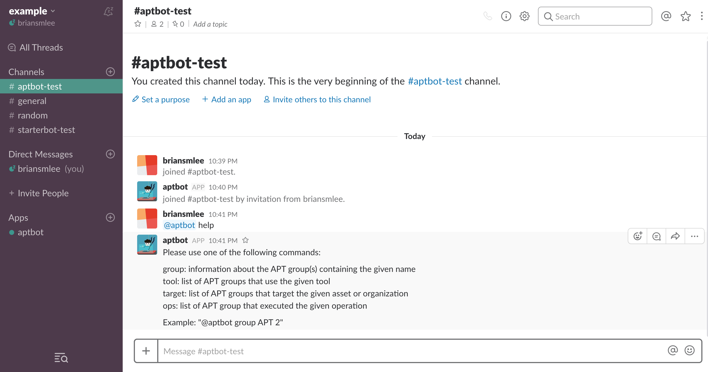
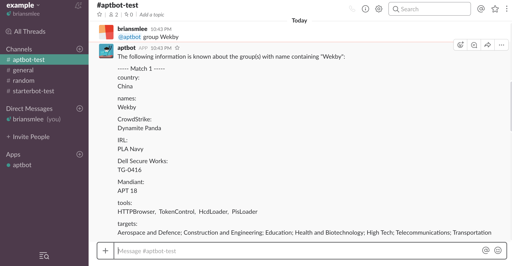
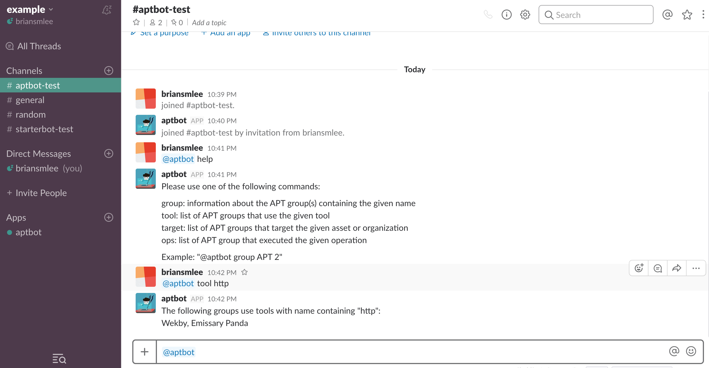
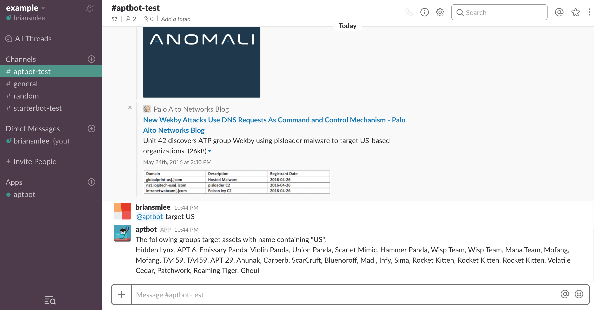
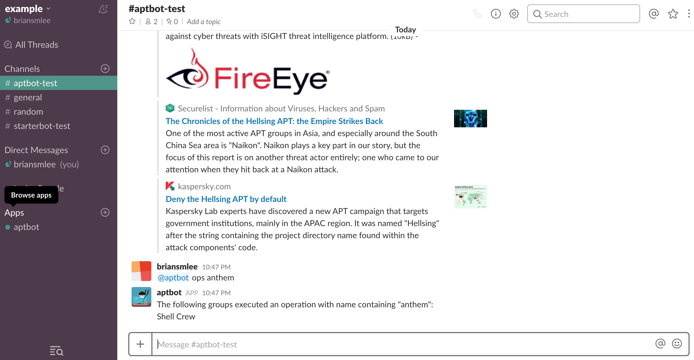

# AptBot

### What is AptBot?
AptBot is a Slack bot for retrieving data about Advanced Persistent Threat (APT) groups.

An advanced persistent threat (APT) is a network attack in which an unauthorized person gains access to a network and stays there undetected for a long period of time.

### Using AptBot

AptBot provides the following four commands:
group - information about the APT group(s) containing the given name
tool - list of APT groups that use the given tool
target - list of APT groups that target the given asset or organization
ops - list of APT group that executed the given operation

The following images show how AptBot can be used:
help:

group:

tool:

target:

ops:

### Installing AptBot
Since AptBot is currently not distributed on Slack, the bot must be added manually to your team.
Please follow the instructions at https://www.fullstackpython.com/blog/build-first-slack-bot-python.html (prior to "Coding Our StarterBot").

### ToDo
integrate with Travis CI
optimize groups data access
format data to attachments

### References
Following sources were used to build the bot:
https://github.com/hslatman/awesome-threat-intelligence
https://docs.google.com/spreadsheets/u/1/d/1H9_xaxQHpWaa4O_Son4Gx0YOIzlcBWMsdvePFX68EKU/pubhtml
https://www.fullstackpython.com/blog/build-first-slack-bot-python.html

